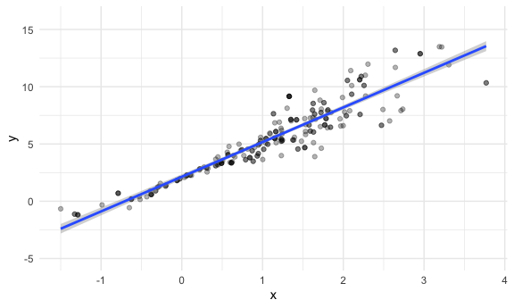

Bootstrapping
================

``` r
library(tidyverse)
```

    ## ── Attaching packages ───────────────────────────────────────────────────────────────── tidyverse 1.3.0 ──

    ## ✓ ggplot2 3.3.2     ✓ purrr   0.3.4
    ## ✓ tibble  3.0.3     ✓ dplyr   1.0.0
    ## ✓ tidyr   1.1.0     ✓ stringr 1.4.0
    ## ✓ readr   1.3.1     ✓ forcats 0.5.0

    ## ── Conflicts ──────────────────────────────────────────────────────────────────── tidyverse_conflicts() ──
    ## x dplyr::filter() masks stats::filter()
    ## x dplyr::lag()    masks stats::lag()

``` r
library(modelr)

knitr::opts_chunk$set(
  fig.width = 6,
  fig.asp = 0.6,
  out.width = "90%"
)

theme_set(theme_minimal() + theme(legend.position = "bottom"))

options(
  ggplot2.continuous.colour = "viridis",
  ggplot2.continuous.fill = "viridis"
)

scale_colour_discrete = scale_colour_viridis_d
scale_fill_discrete = scale_fill_viridis_d
```

## Simulate data

``` r
n_samp = 250

sim_df_const = 
  tibble(
    x = rnorm(n_samp, 1, 1),
    error = rnorm(n_samp, 0, 1),
    y = 2 + 3 * x + error
  )

sim_df_nonconst = 
  sim_df_const %>% 
  mutate(
    error = error * 0.75 * x, 
    y = 2 + 3 * x + error
  )
```

Plot the data set

``` r
sim_df_const %>% 
  ggplot(aes(x = x, y = y)) +
  geom_point() +
  geom_smooth(method = "lm")
```

    ## `geom_smooth()` using formula 'y ~ x'


There is a linear observation - residual has a constabt variance alone
the x axis. Assumptions for simple linear regression met .

``` r
sim_df_nonconst %>% 
  ggplot(aes(x = x, y = y)) +
  geom_point() +
  geom_smooth(method = "lm")
```

    ## `geom_smooth()` using formula 'y ~ x'


The residual variance assumption is not met - CI would be wrong. Methods
to build a CI won’t work here. We can fit OLS but uncertainity cannot be
determined with this dataset.

To overcome this we conduct a bootstrap analysis -

step 1 - Regress

``` r
lm(y ~ x, data = sim_df_const) %>%  broom::tidy()
```

    ## # A tibble: 2 x 5
    ##   term        estimate std.error statistic   p.value
    ##   <chr>          <dbl>     <dbl>     <dbl>     <dbl>
    ## 1 (Intercept)     2.02    0.0845      23.9 2.09e- 66
    ## 2 x               2.98    0.0604      49.4 2.61e-130

``` r
lm(y ~ x, data = sim_df_nonconst) %>%  broom::tidy()
```

    ## # A tibble: 2 x 5
    ##   term        estimate std.error statistic   p.value
    ##   <chr>          <dbl>     <dbl>     <dbl>     <dbl>
    ## 1 (Intercept)     1.99    0.0857      23.2 3.41e- 64
    ## 2 x               3.00    0.0613      48.9 2.00e-129

Step 2 - bootstrap \#\# Draw one bootstrap sample

``` r
boot_sample = function(df) {
  sample_frac(df, replace = TRUE) %>% 
    arrange(x)
}
```

Sample size - dependent on CI so keep the same size of sample.

check if the function works -

``` r
boot_sample(sim_df_nonconst) %>% 
   ggplot(aes(x = x, y = y)) +
  geom_point(alpha = .3) +
  geom_smooth(method = "lm") + 
  ylim(-5, 16)
```

    ## `geom_smooth()` using formula 'y ~ x'



Get intercept and p value

``` r
boot_sample(sim_df_nonconst) %>% 
  lm(y ~x, data = .) %>% 
  broom::tidy()
```

    ## # A tibble: 2 x 5
    ##   term        estimate std.error statistic   p.value
    ##   <chr>          <dbl>     <dbl>     <dbl>     <dbl>
    ## 1 (Intercept)     1.94    0.0823      23.6 2.10e- 65
    ## 2 x               3.02    0.0603      50.1 8.15e-132

## Many samples and analysis

``` r
boot_straps = 
  tibble(
    strap_number = 1:1000,
    strap_sample = rerun(1000, boot_sample(sim_df_nonconst))
  )
```

Running analysis - fit regression to each dataframe

``` r
boot_results = 
  boot_straps %>% 
  mutate(
    models = map(.x = strap_sample, ~lm(y ~ x, data = .x)),
    results = map(models, broom::tidy)
  ) %>% 
  select(strap_number, results) %>% 
  unnest(results)
```

We have intercept and slope for 1 to 1000

``` r
boot_results %>% 
 group_by(term) %>% 
  summarize(
    mean_est = mean(estimate),
    sd_est = sd(estimate)
  )
```

    ## `summarise()` ungrouping output (override with `.groups` argument)

    ## # A tibble: 2 x 3
    ##   term        mean_est sd_est
    ##   <chr>          <dbl>  <dbl>
    ## 1 (Intercept)     1.99 0.0591
    ## 2 x               3.00 0.0811

look at the distributions

``` r
boot_results %>% 
  filter(term == "x") %>% 
  ggplot(aes(x = estimate)) +
  geom_density()
```


Construst a bootstrap CI

``` r
boot_results %>% 
  group_by(term) %>% 
  summarize(
    ci_lower = quantile(estimate, 0.025),
    ci_upper = quantile(estimate, 0.975)
  )
```

    ## `summarise()` ungrouping output (override with `.groups` argument)

    ## # A tibble: 2 x 3
    ##   term        ci_lower ci_upper
    ##   <chr>          <dbl>    <dbl>
    ## 1 (Intercept)     1.87     2.10
    ## 2 x               2.85     3.16

## Bootstrap using modelr package

Automate drawing repeated sampling and analysing them

``` r
sim_df_nonconst %>% 
  bootstrap(1000, id = "strap_number") %>% 
    mutate(
    models = map(.x = strap, ~lm(y ~ x, data = .x)),
    results = map(models, broom::tidy)
  ) %>% 
  select(strap_number, results) %>% 
  unnest(results) %>% 
  group_by(term) %>% 
  summarize(
    ci_lower = quantile(estimate, 0.025),
    ci_upper = quantile(estimate, 0.975)
  )
```

    ## `summarise()` ungrouping output (override with `.groups` argument)

    ## # A tibble: 2 x 3
    ##   term        ci_lower ci_upper
    ##   <chr>          <dbl>    <dbl>
    ## 1 (Intercept)     1.88     2.10
    ## 2 x               2.83     3.16
