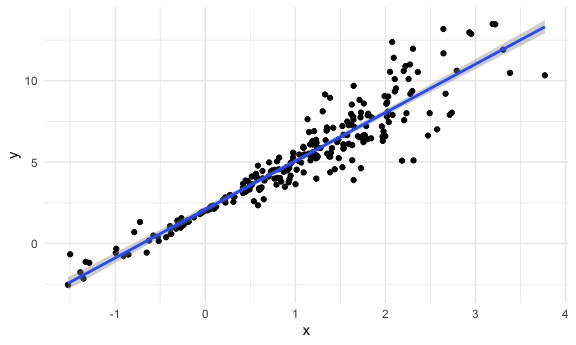

Bootstrapping
================

``` r
library(tidyverse)
```

    ## ── Attaching packages ───────────────────────────────────────────────────────────────── tidyverse 1.3.0 ──

    ## ✓ ggplot2 3.3.2     ✓ purrr   0.3.4
    ## ✓ tibble  3.0.3     ✓ dplyr   1.0.0
    ## ✓ tidyr   1.1.0     ✓ stringr 1.4.0
    ## ✓ readr   1.3.1     ✓ forcats 0.5.0

    ## ── Conflicts ──────────────────────────────────────────────────────────────────── tidyverse_conflicts() ──
    ## x dplyr::filter() masks stats::filter()
    ## x dplyr::lag()    masks stats::lag()

``` r
library(modelr)

knitr::opts_chunk$set(
  fig.width = 6,
  fig.asp = 0.6,
  out.width = "90%"
)

theme_set(theme_minimal() + theme(legend.position = "bottom"))

options(
  ggplot2.continuous.colour = "viridis",
  ggplot2.continuous.fill = "viridis"
)

scale_colour_discrete = scale_colour_viridis_d
scale_fill_discrete = scale_fill_viridis_d
```

## Simulate data

``` r
n_samp = 250

sim_df_const = 
  tibble(
    x = rnorm(n_samp, 1, 1),
    error = rnorm(n_samp, 0, 1),
    y = 2 + 3 * x + error
  )

sim_df_nonconst = 
  sim_df_const %>% 
  mutate(
    error = error * 0.75 * x, 
    y = 2 + 3 * x + error
  )
```

Plot the data set

``` r
sim_df_const %>% 
  ggplot(aes(x = x, y = y)) +
  geom_point() +
  geom_smooth(method = "lm")
```

    ## `geom_smooth()` using formula 'y ~ x'


There is a linear observation - residual has a constabt variance alone
the x axis. Assumptions for simple linear regression met .

``` r
sim_df_nonconst %>% 
  ggplot(aes(x = x, y = y)) +
  geom_point() +
  geom_smooth(method = "lm")
```

    ## `geom_smooth()` using formula 'y ~ x'



The residual variance assumption is not met - CI would be wrong. Methods
to build a CI won’t work here. We can fit OLS but uncertainity cannot be
determined with this dataset.

To overcome this we conduct a bootstrap analysis -

step 1 - Regress

``` r
lm(y ~ x, data = sim_df_const) %>%  broom::tidy()
```

    ## # A tibble: 2 x 5
    ##   term        estimate std.error statistic   p.value
    ##   <chr>          <dbl>     <dbl>     <dbl>     <dbl>
    ## 1 (Intercept)     1.85    0.0850      21.7 2.10e- 59
    ## 2 x               3.14    0.0600      52.3 5.60e-136

``` r
lm(y ~ x, data = sim_df_nonconst) %>%  broom::tidy()
```

    ## # A tibble: 2 x 5
    ##   term        estimate std.error statistic   p.value
    ##   <chr>          <dbl>     <dbl>     <dbl>     <dbl>
    ## 1 (Intercept)     2.02    0.0903      22.4 1.91e- 61
    ## 2 x               3.08    0.0637      48.3 3.08e-128

Step 2 - bootstrap \#\# Draw one bootstrap sample

``` r
boot_sample = function(df) {
  sample_frac(df, replace = TRUE) %>% 
    arrange(x)
}
```

Sample size - dependent on CI so keep the same size of sample.

check if the function works -

``` r
boot_sample(sim_df_nonconst) %>% 
   ggplot(aes(x = x, y = y)) +
  geom_point(alpha = .3) +
  geom_smooth(method = "lm") + 
  ylim(-5, 16)
```

    ## `geom_smooth()` using formula 'y ~ x'


Get intercept and p value

``` r
boot_sample(sim_df_nonconst) %>% 
  lm(y ~x, data = .) %>% 
  broom::tidy()
```

    ## # A tibble: 2 x 5
    ##   term        estimate std.error statistic   p.value
    ##   <chr>          <dbl>     <dbl>     <dbl>     <dbl>
    ## 1 (Intercept)     2.00    0.0844      23.7 1.12e- 65
    ## 2 x               3.17    0.0598      53.0 2.87e-137
